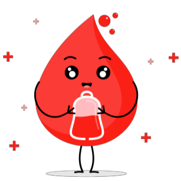

<!-- Improved compatibility of back to top link: See: https://github.com/othneildrew/Best-README-Template/pull/73 -->

<!--
*** Thanks for checking out the Best-README-Template. If you have a suggestion
*** that would make this better, please fork the repo and create a pull request
*** or simply open an issue with the tag "enhancement".
*** Don't forget to give the project a star!
*** Thanks again! Now go create something AMAZING! :D
-->

<!-- PROJECT SHIELDS -->
<!--
*** I'm using markdown "reference style" links for readability.
*** Reference links are enclosed in brackets [ ] instead of parentheses ( ).
*** See the bottom of this document for the declaration of the reference variables
*** for contributors-url, forks-url, etc. This is an optional, concise syntax you may use.
*** https://www.markdownguide.org/basic-syntax/#reference-style-links
-->

<!-- PROJECT LOGO -->
 

  

<h2 align="center">My blood</h2>

  

    Web application for personal blood giving in a form of log book with possibility to check the current blood giving actions (e.g. away blood giving)
     
     
     

<!-- TABLE OF CONTENTS -->

  
Table of Contents

  <ol>
    <li>
      <a href="#about-the-project">About The Project</a>
      <ul>
        <li><a href="#built-with">Built With</a></li>
      </ul>
    </li>
    <li>
      <a href="#getting-started">Getting Started</a>
      <ul>
        <li><a href="#prerequisites">Prerequisites</a></li>
        <li><a href="#installation">Installation</a></li>
      </ul>
    </li>
    <li><a href="#roadmap">Roadmap</a></li>
    <li><a href="#license">License</a></li>
    <li><a href="#acknowledgments">Acknowledgments</a></li>
  </ol>

<!-- ABOUT THE PROJECT -->
## About The Project

### Built With

* [![Python][Python.org]][Python-url]
* [![Flask][Flask-badge]][Flask-url]
* [![PostgreSQL][PostgreSQL.org]][PostgreSQL-url]
* ![HTML]
* ![CSS]
* ![JS]

(<a href="#readme-top">back to top</a>)

<!-- GETTING STARTED -->
## Getting Started

### Prerequisites

Whole project is based on Python and Postgres database.

* **Python**
  * It is best to work within Python virtual environments - if you do NOT know how to setup a virtual environment, here is a [link](https://docs.python.org/3/library/venv.html) 😊
  * All prerequisite libraries used in Python are listed in [`requirements.txt`](https://github.com/mattix1710/app-sec-app/blob/main/requirements.txt) file.
    
    They are also listed below:

| Library | Version |
|---------|---------|
| Python  | 3.12    |
| Flask   | 3.0.0   |
| psycopg | 3.1.13  |

* **PostgreSQL**
  * e.g. running as *Docker container* - for this project the official image (provided by Docker) was chosen

### Installation

🚧🚧🚧
> TODO: Installation description

(<a href="#readme-top">back to top</a>)

<!-- USAGE EXAMPLES -->
<!-- ## Usage

Use this space to show useful examples of how a project can be used. Additional screenshots, code examples and demos work well in this space. You may also link to more resources.

_For more examples, please refer to the [Documentation](https://example.com)_

(<a href="#readme-top">back to top</a>)
 -->

<!-- ROADMAP -->
## Roadmap

- [ ] Create login/register forms
  - [ ] Allow user authentication
  - [ ] Create relational database in Postgres environment
- [ ] Create users profile site
    - [ ] Add view of gave blood status
    - [ ] Add view for local blood giving actions

(<a href="#readme-top">back to top</a>)

<!-- LICENSE -->
## License

No license chosen at the time of creating this repository!
<!-- Distributed under the MIT License. See `LICENSE.txt` for more information. -->

(<a href="#readme-top">back to top</a>)

<!-- ACKNOWLEDGMENTS -->
## Acknowledgments

* [Flask structure template](https://github.com/miguelgrinberg/flasky/tree/master)
* [Gitmoji - guide for commit messages](https://gitmoji.dev)
* [Best-README-Template](https://github.com/othneildrew/Best-README-Template/tree/master)
* [Blood drop image](https://www.creativefabrica.com/pl/product/blood-donor-day-heart-and-blood-drop-22/)

(<a href="#readme-top">back to top</a>)

<!-- MARKDOWN LINKS & IMAGES -->
<!-- https://www.markdownguide.org/basic-syntax/#reference-style-links -->
[Python.org]: https://img.shields.io/badge/Python-3776AB?style=for-the-badge&logo=python&logoColor=white
[Python-url]: https://www.python.org
[Flask-url]: https://flask.palletsprojects.com/en/3.0.x/
[PostgreSQL-url]: https://www.postgresql.org

[Flask-badge]: https://img.shields.io/badge/Flask-000000?style=for-the-badge&logo=flask&logoColor=white
[PostgreSQL.org]: https://img.shields.io/badge/PostgreSQL-316192?style=for-the-badge&logo=postgresql&logoColor=white
[HTML]: 	https://img.shields.io/badge/HTML-239120?style=for-the-badge&logo=html5&logoColor=white
[CSS]: https://img.shields.io/badge/CSS-239120?&style=for-the-badge&logo=css3&logoColor=white
[JS]: https://img.shields.io/badge/JavaScript-F7DF1E?style=for-the-badge&logo=javascript&logoColor=black